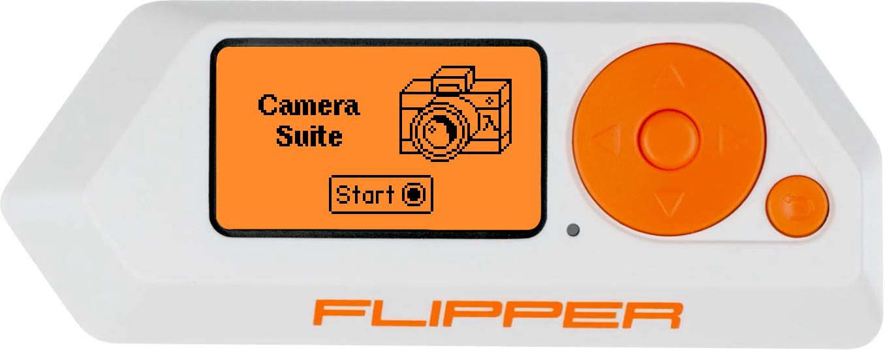
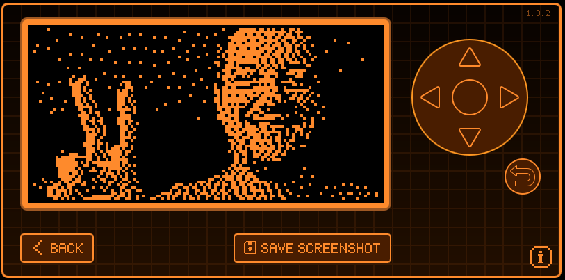
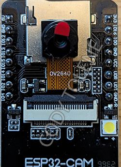
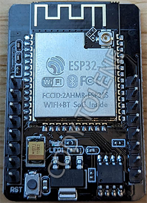
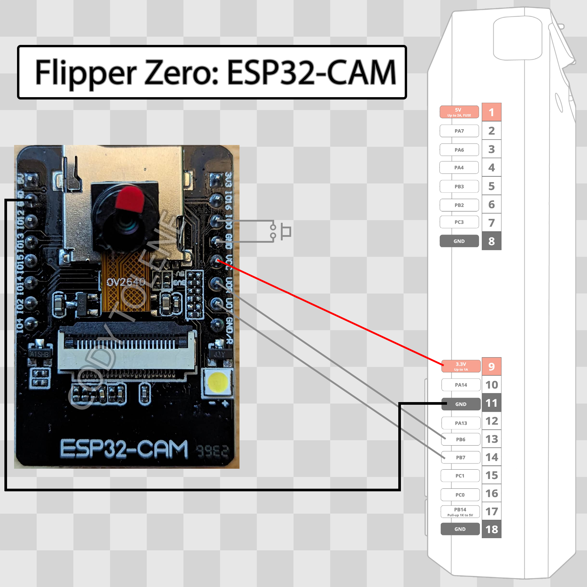
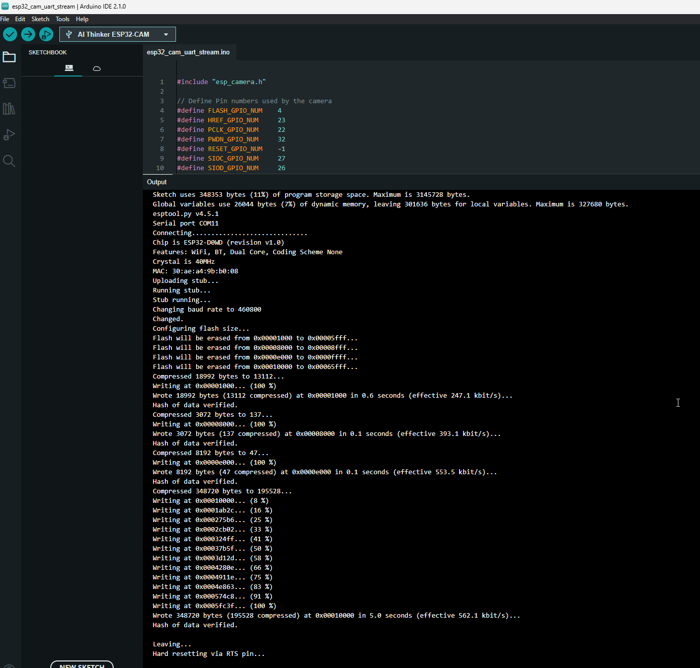

<div align="center">
  
  <h2 align="center">Flipper Zero - Camera Suite</h2>
  <p align="center">
    Firmware and software to run an ESP32-CAM module and capture FULL COLOR images on your Flipper Zero device.
  </p>
  <a href="https://shop.flipperzero.one/">
    
  </a>
  <a href="https://docs.flipperzero.one/">
    
  </a>
</div>

---

## Introduction



### Welcome to the ESP32-CAM Suite for Flipper Zero

Discover a new dimension of possibilities by connecting your ESP32-CAM module with your Flipper Zero device. The ESP32-CAM module, a ~~compact powerful~~ cheap camera module, enables you to capture images and stream a ~~live~~ video to your Flipper Zero. With this suite, your Flipper Zero becomes a hub of creativity ~~and utility~~.

**What You Can Do:**

- **Capture Moments:** This custom Flipper Zero application empowers you to take pictures ~~effortlessly~~. View realish-time image previews on your Flipper Zero screen while you capture ~~high quality~~ blocky and pixelated FULL COLOR memories! Hey it's still a memory and we're at least having fun...

- **Personalize Your Experience:** Tailor your camera settings with ease. Adjust camera orientation, experiment with various dithering options, and toggle flash, haptic feedback, sound effects, and LED effects to match your preferences. Feel free to use this as a flashlight too, it's pretty bright and good at blinding yourself unexpectedly!

~~There will be many more features added in the future!~~

<p align="right">[ <a href="#index">Back to top</a> ]</p>

## Hardware Requirements

Requires an ESP32-CAM module. Below are two images of the ESP32-CAM module. You can find these all over Amazon, Ali Express, and other retailers.



<p align="right">[ <a href="#index">Back to top</a> ]</p>

## Hardware Installation

Below is the pinout guide and diagram for the ESP32-CAM module to the Flipper Zero. From the ESP32-CAM module to the Flipper Zero:

```markdown
VCC to 3V3
GND to GND (Be sure to use the right GND, see image below.)
U0R to TX
U0T to RX
```

On the ESP32-CAM module itself you'll also need to connect the `IO0` pin to `GND`. This will place the module into flash mode for installing the firmware later on (see [Firmware Installation](#firmware-installation)). You can do this by connecting a jumper wire, a button, or a switch to do this.



<p align="right">[ <a href="#index">Back to top</a> ]</p>

## Firmware Installation

1. Clone/download this repository to your computer.
2. Download and install the Arduino IDE from [here][arduino-ide].
3. Open `flipper-zero-camera-suite\firmware\firmware.ino` with your Arduino IDE.
4. In the Arduino IDE, go to `File > Preferences`.
5. In the `Settings` tab, add the following URL to the `Additional Boards Manager URLs` field:

   ```markdown
   https://dl.espressif.com/dl/package_esp32_index.json
   ```

6. In the Arduino IDE, go to `Tools > Board > Boards Manager`.
7. Search for `esp32` and install `esp32` by `Espressif Systems`.
8. Plug in your Flipper Zero via USB. Make sure qFlipper or something else isn't connected to it already after doing so.
9. On your Flipper Zero, open `GPIO > USB-UART Bridge`.
10. In the Arduino IDE, go to `Tools > Board > esp32 > AI Thinker ESP32-CAM`.
11. In the Arduino IDE, go to `Tools > Port` and select the port that your Flipper Zero is connected to.
12. Plug in the ESP32-CAM module to your Flipper Zero while connecting the `IO0` pin to `GND`. See [Hardware Installation](#hardware-installation) for more information.
13. Press the RST button on the back of the ESP32-CAM module to boot it into flash mode.
14. In the Arduino IDE, go to `Sketch > Upload` to upload the firmware to your ESP32-CAM module. You will see upload progress in % and receive a message on completion if successful.
15. Fin! Now you may use the [Software Installation](#software-installation) section to install the software on your Flipper Zero to take advantage of this hardwares firmware.

Note the upload may fail a few times, this is normal, try again. If it still fails, try pressing the RST button on the back of the ESP32-CAM module again or checking your connections.

On success, your screen should look like this:



</details>

<p align="right">[ <a href="#index">Back to top</a> ]</p>

## Software Installation

1. Connect your Flipper Zero via USB, or insert your MicroSD.
2. Navigate to the latest GitHub "Build + upload" action [here][github-actions-link].
3. Open the most recent action on that page (top of the list) and download the fap zip for either "dev" or "release" build versions of the Flipper Zero firmware depending on your usage. Generally you'll want to use the "release" build version.
4. Move "camera_suite.fap" into `~\apps\gpio\` on your Flipper Zero MicroSD:

   ```markdown
   .                        # The Flipper Zero MicroSD root.
   ├── apps                 # The Flipper Zero Applications folder.
   | ├── gpio               # The Flipper Zero GPIO folder.
   | | ├── camera_suite.fap # The Camera Suite application.
   ```

5. Reinsert your MicroSD into your Flipper Zero if you took it out.
6. Plug in your ESP32-CAM module to your Flipper Zero.
7. Press the "Power" button on your Flipper Zero to turn it on.
8. Open the application "[ESP32] Camera Suite":

   ```markdown
   Applications > GPIO > [ESP32] Camera Suite
   ```

9. That's it! Follow the on screen instructions to continue.

</details>

<p align="right">[ <a href="#index">Back to top</a> ]</p>

## Software Guide

### Flipper Zero button mappings

| Button | Action |
| :----- | :----- |
| 🔼     | Contrast Up |
| 🔽     | Contrast Down |
| ◀️     | Toggle invert |
| ▶️     | Toggle dithering on/off |
| ↩️     | Go back |
| 🔵     | Take a picture and save to the "DCIM" folder at the root of your SD card flipper zero SD card. Additionally if an SD card is isntalled in the ESP32-CAM a higher resolution FULL COLOR image will be saved in the .ppm format to the root of the SD card |

### Camera Settings

| Setting | Description |
| :------ | :---------- |
| **Orientation** | Rotate the camera image 90 degrees counter-clockwise starting at zero by default (0, 90, 180, 270). This is useful if you have your camera module mounted in a different orientation than the default. |
| **Dithering Type** | Change between the Cycle Floyd–Steinberg, Jarvis-Judice-Ninke, and Stucki dithering types. |
| **Flash** | Toggle the ESP32-CAM onboard LED on/off while using the camera. |

### Application Settings

| Setting | Description |
| :------ | :---------- |
| **Haptic Effects** | Toggle haptic feedback on/off. |
| **Sound Effects** | Toggle sound effects on/off. |
| **LED Effects** | Toggle LED effects on/off. |

<p align="right">[ <a href="#index">Back to top</a> ]</p>

## Attribution

This project is 100% derrived from the work of Cody Tolene and the amazing people who have contributed to his repo. https://github.com/CodyTolene/Flipper-Zero-Camera-Suite.

<p align="right">[ <a href="#index">Back to top</a> ]</p>

## Licensing

This project is licensed under the BSD 3-Clause license. See the [LICENSE](LICENSE) file for details. Certain files in this project are based on code from Espressif Systems (Shanghai) PTE LTD and are licensed under the Apache License, Version 2.0. See the [APACHE_2_LICENSE](LICENSE.Apache-2.0) file for the pertaining license text.

`SPDX-License-Identifier: BSD 3-Clause, Apache-2.0`

<p align="right">[ <a href="#index">Back to top</a> ]</p>
